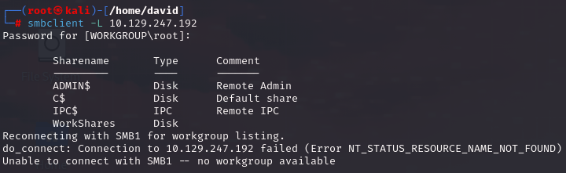
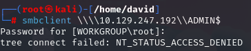
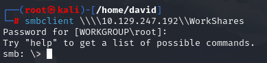
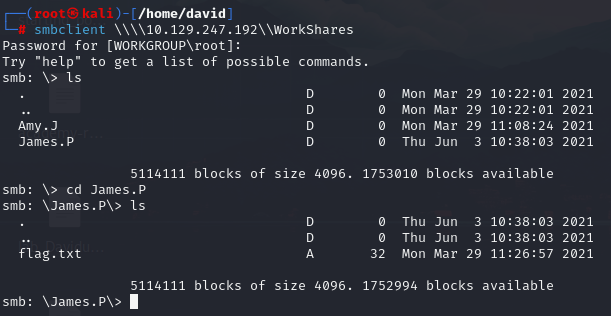
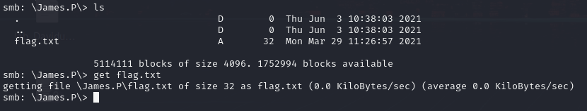
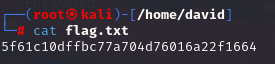

# Dancing

## Información General

- **Dificultad**: Very easy
- **Sistema Operativo**: Windows
- **Técnicas/herramientas usadas**: nmap / smbclient / 

### Task 1 - What does the 3-letter acronym SMB stand for?

El acrónimo de tres letras SMB significa **Server Message Block**. Es un protocolo de red utilizado para compartir archivos, impresoras y otros recursos entre dispositivos en una red.

#### Answer -- Server Message Block

### Task 2 - What port does SMB use to operate at?

Generalmente, el servicio de SMB opera en el puerto **445**. Para comprobarlo, vamos a lanzar un escaneo con nmap y ver en qué puerto se encuentra en este caso.


#### Answer -- 445

### Task 3 - What is the service name for port 445 that came up in our Nmap scan?

Como podemos observar en la iamgen anterior de nuestro escaneo con nmap, el servicio que está operando en el puerto 445 es **microsoft-ds**

#### Answer -- microsoft-ds


### Task 4 - What is the 'flag' or 'switch' that we can use with the smbclient utility to 'list' the available shares on Dancing?

Una vez que hemos comprobado que tenemos un servicio de samba levantado, para poder listar o enumerar los directorios compartidos, tenemos que usar la herramienta **smbclient**. Para listar los directorios compartidos que se encuentran en la máquina objetivo utilizaremos el siguiente comando:

```
smbclient -L IP_objetivo
```



#### Answer -- -L

### Task 5 - How many shares are there on Dancing?

Si observamos la imagen anterior, podemos comprobar como hay **4 directorios compartidos** en el servicio de SMB. 

#### Answer -- 4


### Task 6 - What is the name of the share we are able to access in the end with a blank password?

Para probar a conectarnos a cada uno de los recursos compartidos alojados en SMB, vamos a utilizar el siguiente comando:

```
smbclient \\\\IP_objetivo\\nombre_directorio
```

Ya que no conocemos ninguna contraseña de acceso, vamos a probar con la contraseña en blanco. El primer recurso al que intentamos acceder es el de ADMIN$. Sin embargo, como era de esperar, no se nos permite la conexión con la contraseña en blanco. 



Viendo los nombres de los directorios, parece que el directorio **WorkShares** podría ser un buen punto de entrada. Probamos el acceso sin contraseña y obtenemos una conexión.



#### Answer -- WorkShares


### Task 7 - What is the command we can use within the SMB shell to download the files we find?

Ahora que estamos conectados al recurso compartido de WorkShares, vamos a tratar de encontrar la flag navegando por los distintos directorios. Usando los mismos comandos que usaríamos en nuestro Kali (ls, cd, etc...) encontramos que la flag se encuentra en el directorio de James.P



Para poder descargar la flag, al igual que hicimos en la máquina de Fawn cuando nos conectamos por FTP, podemos usar el comando **get** para obtenerla en nuestra máquina.



#### Answer -- get

### Submit root flag

