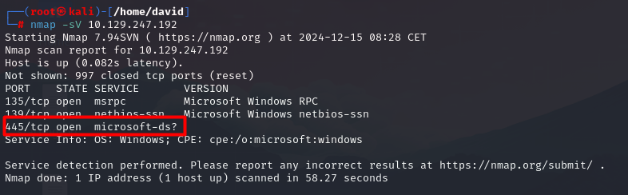

# Dancing

## Información General

- **Dificultad**: Very easy
- **Sistema Operativo**: Windows
- **Técnicas/herramientas usadas**: nmap /  / 

### Task 1 - What does the 3-letter acronym SMB stand for?

El acrónimo de tres letras SMB significa **Server Message Block**. Es un protocolo de red utilizado para compartir archivos, impresoras y otros recursos entre dispositivos en una red.

#### Answer -- Server Message Block

### Task 2 - What port does SMB use to operate at?

Generalmente, el servicio de SMB opera en el puerto **445**. Para comprobarlo, vamos a lanzar un escaneo con nmap y ver en qué puerto se encuentra en este caso.

#### Answer -- 445

### Task 3 - What is the service name for port 445 that came up in our Nmap scan?

Como podemos observar en la iamgen anterior de nuestro escaneo con nmap, el servicio que está operando en el puerto 445 es **microsoft-ds**

#### Answer -- microsoft-ds

### Task 4 - What is the 'flag' or 'switch' that we can use with the smbclient utility to 'list' the available shares on Dancing?

Una vez que hemos comprobado que 

#### Answer -- 

### Task 5 - How many shares are there on Dancing?

#### Answer -- 

### Task 6 - What is the name of the share we are able to access in the end with a blank password?

#### Answer -- 

### Task 7 - What is the command we can use within the SMB shell to download the files we find?

#### Answer -- 

### Submit root flag