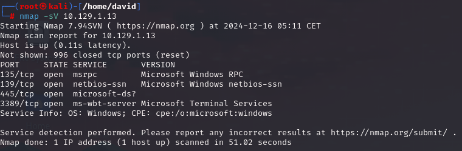
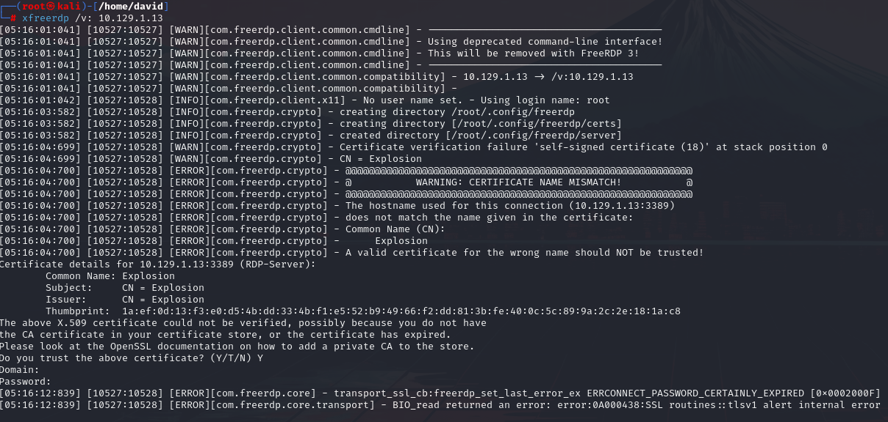
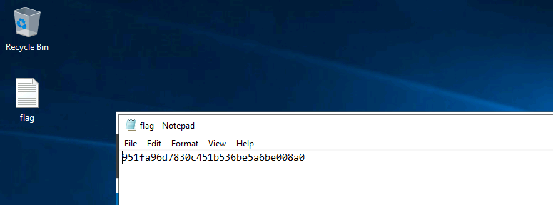

# Explosion

## Información General

- **Dificultad**: Very easy
- **Sistema Operativo**: Windows
- **Técnicas/herramientas usadas**: nmap / xfreerdp / 

### Task 1 - What does the 3-letter acronym RDP stand for?

RDP significa Protocolo de Escritorio Remoto (**Remote Desktop Protocol**). Es un protocolo desarrollado por Microsoft que permite a los usuarios conectarse y controlar de forma remota otro equipo a través de una conexión de red.

#### Answer -- Remote Desktop Protocol

### Task 2 - What is a 3-letter acronym that refers to interaction with the host through a command line interface?

La respuesta es **CLI**, que significa Interfaz de Línea de Comandos. Es una forma de interactuar con un sistema operativo o software a través de comandos de texto escritos en una terminal o consola.

#### Answer -- CLI

### Task 3 - What about graphical user interface interactions?

La respuesta es **GUI**, que significa Interfaz Gráfica de Usuario. Es un tipo de interfaz que permite a los usuarios interactuar con un sistema operativo o software mediante elementos gráficos, como ventanas, iconos y botones, en lugar de usar solo comandos de texto.

#### Answer -- GUI

### Task 4 - What is the name of an old remote access tool that came without encryption by default and listens on TCP port 23?

El nombre de la herramienta de acceso remoto antigua que venía sin cifrado por defecto y escucha en el puerto TCP 23 es **Telnet**. Es un protocolo que permite conectarse a otro dispositivo de manera remota, pero debido a la falta de cifrado, ha sido reemplazado en gran medida por alternativas más seguras como SSH.

#### Answer -- Telnet

### Task 5 - What is the name of the service running on port 3389 TCP?

Al lanzar nuestro escaneo de nmap podemos observar los siguientes puertos y servicios disponibles en la máquina objetivo:



El servicio que está corriendo en el puerto 3389 es **ms-wbt-server**.

#### Answer -- ms-wbt-server

### Task 6 - What is the switch used to specify the target host's IP address when using xfreerdp?

Para poder conectarnos a la máquina objetivo, en este caso necesitamos una herramienta conocida como xfreerdp. Para especificar el hostname (máquina objetivo) usaremos el parámetro **/v:** como podemos ver a continuación:



Sin embargo, al intentar conectarnos como root la conexión no es válida ya que nos pide un certificado válido para nuestro usuario.

#### Answer -- /v:

### Task 7 - What username successfully returns a desktop projection to us with a blank password?

Para poder conectarnos, debemos utilizar el usuario Administrador (típico de máquinas Windows) y una opción de la herramienta xfreerdp pra que ignore la petición de certificado. El comando a utilizar es el siguiente:

```
xfreerdp /v:IP_objetivo /cert:ignore /u:Administrator 
```

Se nos pedirá una contraseña para el usuario Administrator, pero podemos dejarla en blanco y darle a enter ya que no tiene ninguna contraseña configurada.

#### Answer -- Administrator

### Submit root flag

Al ejecutar el comando se nos abrirá una ventana con una conexión a un equipo Windows. Podremos encontrar la flag en el escritorio de la máquina objetivo.

