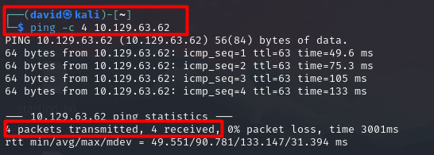
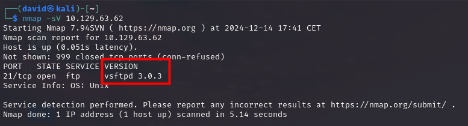
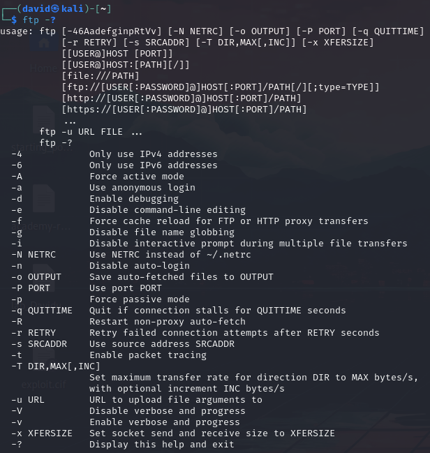
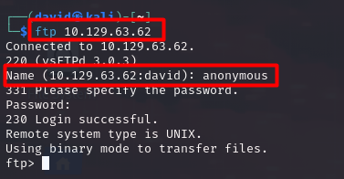
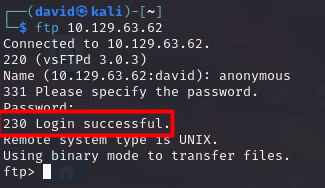
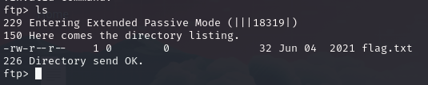
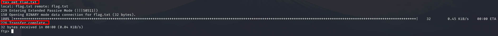
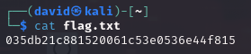

# Fawn

## Información General

- **Dificultad**: Very easy
- **Sistema Operativo**: Linux
- **Técnicas/herramientas usadas**: nmap / FTP / 

### Task 1 - What does the 3-letter acronym FTP stand for?

FTP significa Protocolo de Transferencia de Archivos (en inglés, **File Transfer Protocol**). Es un protocolo de red utilizado para transferir archivos entre un cliente y un servidor en una red, como Internet. 

#### Answer -- File Transfer Protocol

### Task 2 - Which port does the FTP service listen on usually?

El servicio FTP suele escuchar en el **puerto 21** de manera predeterminada. De hecho, en esta máquina, al hacer un nmap, podemos ver como el servicio FTP se encuentra en el puerto 21.


#### Answer -- 21

### Task 3 - FTP sends data in the clear, without any encryption. What acronym is used for a later protocol designed to provide similar functionality to FTP but securely, as an extension of the SSH protocol?

El acrónimo utilizado para el protocolo diseñado para proporcionar funcionalidades similares a FTP de manera segura, como una extensión del protocolo SSH, es SFTP (Secure File Transfer Protocol).

#### Answer -- SFTP


### Task 4 - What is the command we can use to send an ICMP echo request to test our connection to the target?

El comando que se utiliza para enviar una solicitud de eco ICMP para probar la conexión con un objetivo es **ping**. Con el parámetro -c 4 y la IP objetivo, podemos en este caso limitar el envío de paquetes a 4.



#### Answer -- ping

### Task 5 - From your scans, what version is FTP running on the target?

Como podemos ver en la imagen de nuestro escaneo de nmap, la versión del servicio FTP en la máquina objetivo es la **vsftpd 3.0.3**.



#### Answer -- vsftpd 3.0.3


### Task 6 - From your scans, what OS type is running on the target?

Al igual que en el caso anterior, si revisamos nuestro escaneo de nmap, veremos que la versión del sistema operativo corresponde a **Unix**

#### Answer -- Unix


### Task 7 - What is the command we need to run in order to display the 'ftp' client help menu?

El comando que usamos para desplegar el menú de ayuda para ftp es **ftp -?** como podemos observar en la siguiente imagen:



#### Answer -- ftp -?

### Task 8 - What is username that is used over FTP when you want to log in without having an account?

El usuario que podemos usar para iniciar sesión en el servicio FTP sin tener una cuenta es **anonymous**. Para conectarnos al servicio FTP usamos el siguiente comando:

```
ftp IP_objetivo
```
Es importante tener en cuenta que al conectarnos por FTP como anonymous, deberemos dejar la contraseña en blanco y darle al enter.



#### Answer -- anonymous

### Task 9 - What is the response code we get for the FTP message 'Login successful'?

Como podemos ver en la siguiente imagen, el código que nos indica que la conexión ha sido satisfactoria es el **230**.



#### Answer -- 230

### Task 10 - There are a couple of commands we can use to list the files and directories available on the FTP server. One is dir. What is the other that is a common way to list files on a Linux system.

Una vez qe estamos conectados por FTP a la máquina, al igual que en nuestro Kali o en cualquier otra distribución de Linux, podemos usar el comando **ls** para listar el contenido del directorio en el que estamos.



#### Answer -- ls

### Task 11 - What is the command used to download the file we found on the FTP server?

El comando que usamos para descargar archivos desde el servicio FTP es **get**. Como podemos observar, al descargar el archivo flag.txt con get, si la descarga ha sido satisfactoria veremos un mensaje con el código 226 indicando que la descarga se ha completado.



#### Answer -- get

### Submit root flag

Una vez que hemos descargado el archivo, simplemente nos queda hacer un cat del mismo y obtendremos la flag. Es importante tener en cuenta, que el archivo se descargará en el mismo directorio en el que abrimos nuestra conexión FTP. Es decir, si nosotros lanzamos el comando FTP IP_objetivo estando en el directorio /home/usuario/Desktop, el archivo descargado mediante get se alojará en ese directorio.


