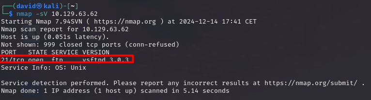

# Fawn

## Información General

- **Dificultad**: Very easy
- **Sistema Operativo**: Linux
- **Técnicas/herramientas usadas**: nmap /  / 

### Task 1 - What does the 3-letter acronym FTP stand for?

FTP significa Protocolo de Transferencia de Archivos (en inglés, **File Transfer Protocol**). Es un protocolo de red utilizado para transferir archivos entre un cliente y un servidor en una red, como Internet. 

#### Answer -- File Transfer Protocol

### Task 2 - Which port does the FTP service listen on usually?

El servicio FTP suele escuchar en el **puerto 21** de manera predeterminada. De hecho, en esta máquina, al hacer un nmap, podemos ver como el servicio FTP se encuentra en el puerto 21.

#### Answer -- 21

### Task 3 - FTP sends data in the clear, without any encryption. What acronym is used for a later protocol designed to provide similar functionality to FTP but securely, as an extension of the SSH protocol?

El acrónimo utilizado para el protocolo diseñado para proporcionar funcionalidades similares a FTP de manera segura, como una extensión del protocolo SSH, es SFTP (Secure File Transfer Protocol).

#### Answer -- SFTP

### Task 4 - What is the command we can use to send an ICMP echo request to test our connection to the target?

### Task 5 - From your scans, what version is FTP running on the target?

### Task 6 - From your scans, what OS type is running on the target?

### Task 7 - What is the command we need to run in order to display the 'ftp' client help menu?

### Task 8 - What is username that is used over FTP when you want to log in without having an account?

### Task 9 - What is the response code we get for the FTP message 'Login successful'?

### Task 10 - There are a couple of commands we can use to list the files and directories available on the FTP server. One is dir. What is the other that is a common way to list files on a Linux system.

### Task 11 - What is the command used to download the file we found on the FTP server?

### Submit root flag

