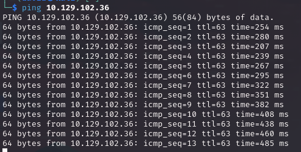
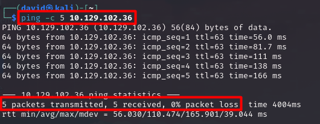
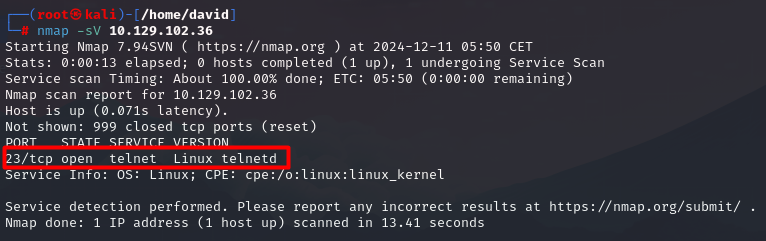
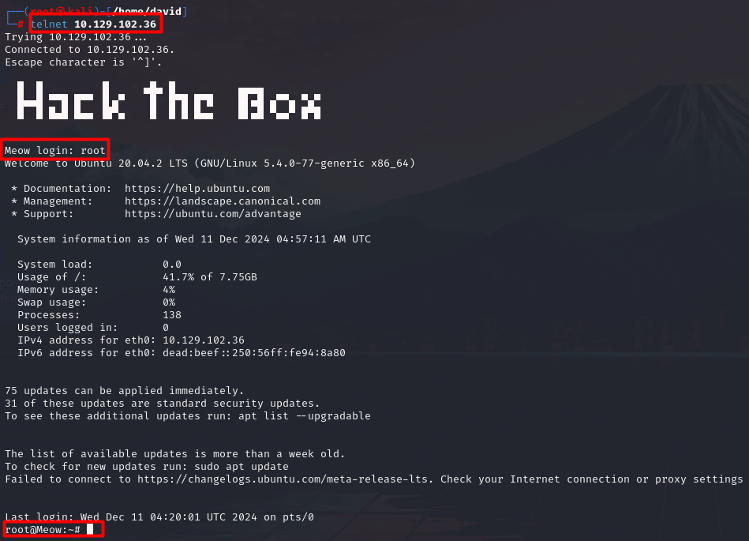
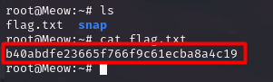

# Meow

## Información General

- **Dificultad**: Very easy
- **Sistema Operativo**: Linux
- **Técnicas/herramientas usadas**: nmap / telnet / 

### Task 1 - What does the acronym VM stand for?

El acrónimo VM viene de las siglas en Inglés "Virtual Machine", que en castellano significa **"máquina virtual"**. Una máquina virtual es un entorno de software que emula un ordenador físico, permitiendo ejecutar un sistema operativo (SO) completo, aplicaciones y servicios dentro de un contenedor aislado. A pesar de que la máquina virtual se ejecuta en un ordenador físico (conocida como host), actúa como si fuera una máquina independiente.

#### Answer -- Virtual Machine

### Task 2 - What tool do we use to interact with the operating system in order to issue commands via the command line, such as the one to start our VPN connection? It's also known as a console or shell.

La herramienta que usamos para interactuar con el sistema operativo a través de la línea de comandos, también conocido como "consola", se denomina **terminal**. 

#### Answer -- terminal

### Task 3 - What service do we use to form our VPN connection into HTB labs? 

El servicio que usamos para establecer una conexión con Hack The Box se conoce como **openvpn**. Es importante que cuando vayamos a
conectarnos usando openvpn estemos como root en nuestra máquina. El comando que usaremos para conectarnos es el siguiente:

```
openvpn nombre_archivo_.openvpn
```

#### Answer -- openvpn

### Task 4 - What tool do we use to test our connection to the target with an ICMP echo request?

La herramienta que usamos para probar la conexión hacia la máquina objetivo se conoce como **ping**. El comando que usamos con ping para probar la conexión es el siguiente:

```
ping IP_objetivo
```
Es importante tener en cuenta, que si hacemos un ping a la máquina objetivo y no lo paramos, se enviarán paquetes indefinidamente como vemos en la siguiente imagen:



Para evitar esto, podemos usar el parámetro **-c** seguido del número de paquetes que queremos enviar.

```
ping -c 5 IP_objetivo
```



#### Answer -- ping

### Task 5 - What is the name of the most common tool for finding open ports on a target?

La herramienta de referencia para descubrir puertos y servicios en una máquina objetivo se conoce como **nmap**. Al igual que al usar openvpn, es recomendable usar nmap como root ya que hay parámetros que al lanzar las consultas nmap nos pedirá estar como root. Por ello, es bueno acostumbrarse siempre estar como root en nuestra máquina cuando vayamos a usar nmap.

En esta máquina, el comando que hemos usado con nmap ha sido el siguiente:

```
nmap -sV IP_objetivo
```

#### Answer -- nmap

### Task 6 - What service do we identify on port 23/tcp during our scans?

Con el comando anterior, podemos ver como el servicio que se ejecuta en el puerto 23 es **telnet**. Telnet (Teletype Network) es el nombre de un protocolo de red que nos permite acceder a otra máquina para manejarla remotamente a través de línea de comandos (no permite interfaz gráfica).



#### Answer -- telnet

### Task 7 - What username is able to log into the target over telnet with a blank password?

En muchas ocasiones, debido a fallos de configuración, muchas cuentas se dejan con contraseñas en blanco. Esto es un problema grave de seguridad ya que si se usan cuentas genéricas como admin, administrator o root, cualquier atacante podrá conectarse a la máquina objetivo sin ningún problema.

En esta máquina, vamos a probar a conectarnos por telnet con una cuenta genérica y con contraseña en blanco. 
Para conectarnos por telnet, simplemente usamos el siguiente comando:

```
telnet IP_objetivo
```
Probamos las 3 cuentas mencionadas anteriormente y tuvimos éxito con la cuenta de **root** como se puede ver a continuación.



#### Answer -- root

### Submit root flag

Una vez que estamos conectados a la máquina, simplemente usamos un ls y un cat, para obtener la flag de la máquina objetivo como se ve a continuación:




