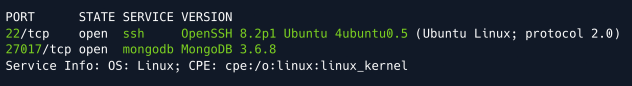

# Mongod

## Información General

- **Dificultad**: Very easy
- **Sistema Operativo**: Linux
- **Técnicas/herramientas usadas**: nmap / mongosh / 

### Task 1 - How many TCP ports are open on the machine?

Empezamos la explotación de la máquina objetivo lanzando un nmap con el siguiente comando:

```
nmap -sV -p- IP_objetivo
```

Usamos el parámetro **-p-** para realizar el escaneo sobre el total de puertos (65535). Los resultados que nos arroja el escaneo son los siguientes:



#### Answer -- 2

### Task 2 - Which service is running on port 27017 of the remote host?

Como podemos ver en la imagen anterior, el servicio que está abierto en el puerto 27017 corresponde a **MongoDB 3.6.8**.

#### Answer -- MongoDB 3.6.8

### Task 3 - What type of database is MongoDB? (Choose: SQL or NoSQL)

MongoDB es una base de datos **NoSQL**. A diferencia de las bases de datos SQL tradicionales, MongoDB almacena datos en documentos con formato JSON, lo que permite mayor flexibilidad y escalabilidad en la gestión de grandes volúmenes de datos no estructurados o semi-estructurados.

#### Answer -- NoSQL

### Task 4 - What is the command name for the Mongo shell that is installed with the mongodb-clients package?

Para poder conectarnos a una base de datos de MongoDB tenemos que usar la herramienta conocida como **mongosh**. Si no está instalada de forma predeterminada en nuestra máquina, podremos descargar el archivo .tgz con el siguiente comando:

```
curl -O https://downloads.mongodb.com/compass/mongosh-2.3.2-linux-x64.tgz
```

Para poder descomprimir el archivo descargado, usaremos el siguiente comando:

```
tar xvf mongosh-2.3.2-linux-x64.tgz
```

Ahora, navegaremos al directorio /bin dentro de nuestra carpeta que contiene la herramienta para poder ejecutarlo.


#### Answer -- mongosh

### Task 5 - What is the command used for listing all the databases present on the MongoDB server? (No need to include a trailing ;)

Para poder conectarnos a la máquina objetivo mediante mongosh vamos a usar el siguiente comando:

```
./mongosh mongodb://10.129.54.129:27017
```

Podremos comprobar como la conexión es satisfactoria. 


Para ver las bases de datos que contiene la máquina objetivo utilizaremos el comando **show dbs;** como se muestra a continuación:


#### Answer -- show dbs

### Task 6 - What is the command used for listing out the collections in a database? (No need to include a trailing ;)

En este caso, vamos a seleccionar la base de datos de "sensitive_information" y para ello usamos el comando **use sensitive_information;**. Una vez seleccionada la base de datos deseada, para ver la información que contiene, usamos el comando **show collections;**.


#### Answer -- show collections

### Task 7 - What is the command used for dumping the content of all the documents within the collection named flag in a format that is easy to read?

Para poder ver la información de un archivo de una base de datos MongoDB tendremos que usar el siguiente comando:

```
db.flag.find().pretty()
```

#### Answer -- db.flag.find().pretty()

### Submit root flag

