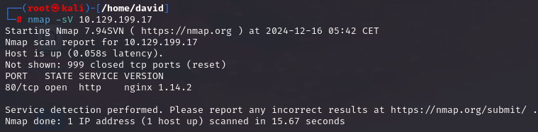
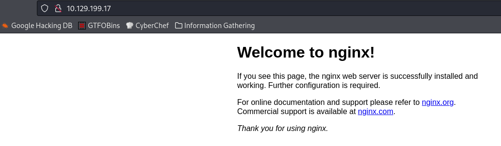
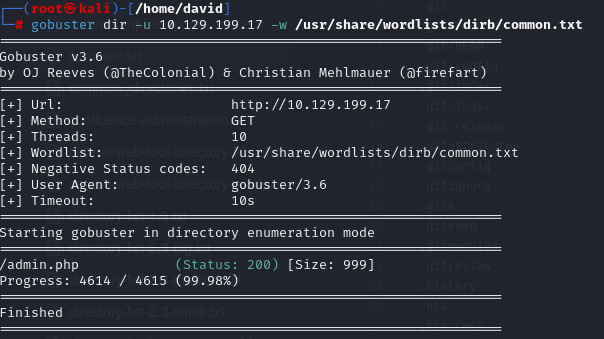
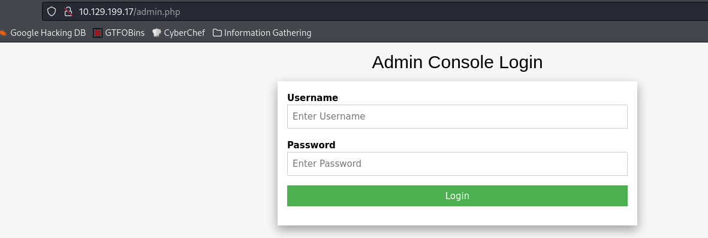
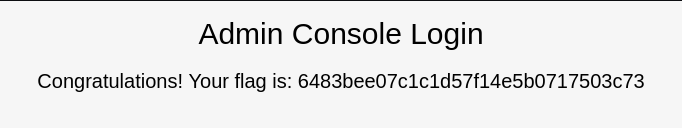

# Preignition

## Información General

- **Dificultad**: Very easy
- **Sistema Operativo**: Linux
- **Técnicas/herramientas usadas**: nmap / gobuster / 

### Task 1 - Directory Brute-forcing is a technique used to check a lot of paths on a web server to find hidden pages. Which is another name for this? (i) Local File Inclusion, (ii) dir busting, (iii) hash cracking.

La técnica de fuerza bruta de directorios en un servidor web para encontrar páginas ocultas también se conoce como **dir busting**.

#### Answer -- dir busting

### Task 2 - What switch do we use for nmap's scan to specify that we want to perform version detection

Como hemos visto en máquinas anteriores, el parámetro que le pasamos a nmap para identificar las versiones de los servicios es **-sV**.

#### Answer -- -sV

### Task 3 - What does Nmap report is the service identified as running on port 80/tcp?

Lanzamos nuestro escaneo de nmap y encontramos que el servicio que está corriendo en el puerto 80 es **http**. 



El servicio HTTP (HyperText Transfer Protocol) es el protocolo que permite la comunicación entre un navegador web y un servidor. Su función principal es transferir datos, como páginas web, imágenes, videos o archivos, desde el servidor hasta el navegador del usuario, para que puedan ser visualizados.

#### Answer -- http

### Task 4 - What server name and version of service is running on port 80/tcp?

Si nos fijamos en nuestro escaneo de nmap (imagen anterior) podemos ver como la versión y el nombre del servicio http corresponde con **nginx 1.14.2**

Si vamos a nuestro navegador web y en la URL especificamos la IP de la máquina objetivo podemos encontrar una página web, pero sin gran información.



Es en este punto cuando tenemos que usar una herramienta de fuerza bruta de directorios para encontrar directorios ocultos que nos ayudan en nuestra fase de explotación.

#### Answer -- nginx 1.14.2

### Task 5 - What switch do we use to specify to Gobuster we want to perform dir busting specifically?

Para realizar una fuerza bruta de directorios vamos a usar la herramienta **gobuster**. Para ello, lanzaremos el siguiente comando:

```
gobuster dir -u IP_objetivo -w /usr/share/wordlists/dirb/common.txt 
```

Con el parámetro -u indicamos la IP de la máquina objetivo y con el parámetro -w la "lista de palabras" de dominios típicos que suelen aparecer en páginas o servidores web. El resultado que nos aparece es el siguiente:



#### Answer -- dir

### Task 6 - When using gobuster to dir bust, what switch do we add to make sure it finds PHP pages?

En el caso de que únicamente quisiéramos encontrar directorios con la extensión .php, podríamos indicarle a gobuster el parámetro **-x php** para asegurarnos de que encuentra directorios de ese tipo.

#### Answer -- -x php

### Task 7 - What page is found during our dir busting activities?

Como hemos visto en la imagen de resultados de gobuster, el directorio oculto que aparece es el de **admin.php**.

#### Answer -- admin.php

### Task 8 - What is the HTTP status code reported by Gobuster for the discovered page?

Si nos fijamos en los resultados de gobuster, podemos observar que nos aparece un código de estado cuando encuentra un directorio. El código de estado es el **200**.

#### Answer -- 200

### Submit root flag

Para finalizar la máquina objetivo, una vez descubierto el directorio oculto, simplemente tenemos que ir a nuestro navegador web y con la dirección IP de la máquina objetivo que indicamos anteriormente en la URL, añadimos el directorio de admin.php de la siguiente manera:



Como podemos observar, se nos abre un panel de login. Generalmente, al llegar a este punto en máquinas de mayor dificultad deberemos realizar pasos extra, pero en este caso vamos a probar con credenciales típicas por defecto. En este caso, conseguimos acceder al portal de login con el par de usuario y contraseña de **admin:admin**.

