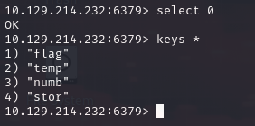

# Redeemer

## Información General

- **Dificultad**: Very easy
- **Sistema Operativo**: Linux
- **Técnicas/herramientas usadas**: nmap / redis / 

### Task 1 - Which TCP port is open on the machine?

En este caso, tenemos que usar el parámetro **-p-** en nuestro escaneo nmap para escanear todos los puertos, ya que si usamos el escaneo básico con los puertos más comunes no encontraremos ningún puerto abierto.

```
nmap -sV -p- 10.129.214.232
```
Al lanzar nuestro escaneo de nmap con el parámetro -p- observamos que el puerto que se encuentra abierto en la máquina es el **6379**.


#### Answer -- 6379

### Task 2 - Which service is running on the port that is open on the machine?

El servicio que se está ejecutando en el puerto 6379 es **Redis**.

Redis (Remote Dictionary Server) es un sistema de almacenamiento de datos NoSQL de código abierto que funciona como base de datos, caché y intermediario de mensajes. Almacena los datos en pares clave-valor, lo que permite una recuperación rápida de información. Redis se utiliza principalmente para almacenar datos a corto plazo, pero también realiza copias de seguridad en disco para garantizar la consistencia.

**El servidor:** 
Redis se ejecuta como software del lado del servidor, donde se centra su funcionalidad principal. Escucha conexiones de clientes, ya sea mediante programas o una interfaz de línea de comandos (CLI).

**CLI:** 
La línea de comandos permite un control completo sobre los datos y funcionalidades de Redis, ideal si estás desarrollando software que necesite interactuar con él.

**Base de datos:** 
La base de datos se almacena en la RAM del servidor para un acceso rápido, y periódicamente se guarda en disco como respaldo en caso de fallos.

#### Answer -- redis

### Task 3 - What type of database is Redis? Choose from the following options: (i) In-memory Database, (ii) Traditional Database

Redis es una base de datos en memoria **(In-memory Database)**. Almacena los datos en la RAM del servidor para un acceso extremadamente rápido.

#### Answer -- In-memory Database


### Task 4 - Which command-line utility is used to interact with the Redis server? Enter the program name you would enter into the terminal without any arguments.

La utilidad de línea de comandos utilizada para interactuar con el servidor Redis es **redis-cli**. Este comando te permite acceder a la interfaz de Redis desde la terminal para ejecutar comandos y gestionar datos.

#### Answer -- redis-cli

### Task 5 - Which flag is used with the Redis command-line utility to specify the hostname?

Como se ve en la siguiente imagen, el parámetro necesario para establecer una conexión a una base de datos de redis es **-h** el cuál sirve para especificar el hostname al que queremos conectarnos.


#### Answer -- -h

### Task 6 - Once connected to a Redis server, which command is used to obtain the information and statistics about the Redis server?

Una vez conectados a un servidor redis, el comando para obtener información y estadísticas sobre el servidor es **info**.


#### Answer -- info


### Task 7 - What is the version of the Redis server being used on the target machine?

Como podemos observar en la imagen anterior, la versión del servidor de redis es la **5.0.7**.

#### Answer -- 5.0.7

### Task 8 - Which command is used to select the desired database in Redis?

Cuando hemos lanzado el comando info para ver la información del servidor redis, en el apartado **"#Keyspace"** podemos observar el número de bases de datos que se encuentran en el servidor y las keys (identificadores únicos utilizados para almacenar datos).


En este caso vemos como solo hay una base de datos (db0). Para seleccionar dicha base de datos usamos el comando **select 0**.

#### Answer -- select

### Task 9 - How many keys are present inside the database with index 0?

Como podemos observar en la imagen anterior, la base de datos con índice 0 cuenta con **4 keys**.

#### Answer -- 4

### Task 10 - Which command is used to obtain all the keys in a database?

Una vez que hemos seleccionado la base de datos deseada, para ver las keys que contiene usamos el comando keys *.



#### Answer -- keys*

### Submit root flag

Para obtener la información de la **key llamada flag** hacemos un get y el nombre de la key.

