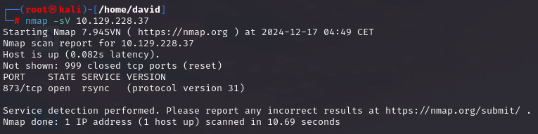
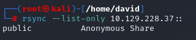
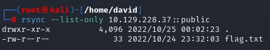
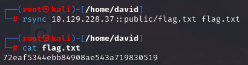

# Synced

## Información General

- **Dificultad**: Very easy
- **Sistema Operativo**: Linux
- **Técnicas/herramientas usadas**: nmap / rsync / 

### Task 1 - What is the default port for rsync?

El puerto predeterminado para rsync es el **873**. Este puerto se utiliza cuando rsync se configura como un servicio de sincronización de archivos en red.

#### Answer -- 873

### Task 2 - How many TCP ports are open on the remote host?

Al lanzar nuestro escaneo básico de nmap solo encontramos un puerto abierto, el 873.



#### Answer -- 1

### Task 3 - What is the protocol version used by rsync on the remote machine?

Si nos fijamos en la imagen anterior de nuestro escaneo de nmap, podemos comprobar que la versión de procolo es la **31**.

#### Answer -- 31

### Task 4 - What is the most common command name on Linux to interact with rsync?

El comando más utilizado para interactuar con rsync, es **rsync** que viene preinstalado por defecto en casi todas las distribuciones de Linux.

#### Answer -- rsync

### Task 5 - What credentials do you have to pass to rsync in order to use anonymous authentication? anonymous:anonymous, anonymous, None, rsync:rsync

Para conectarnos sin autenticación no hace falta poner ninguna contraseña. Para responder a la pregunta que se nos plantea en HTB, la respuesta sería **None**.

#### Answer -- None

### Task 6 - What is the option to only list shares and files on rsync? (No need to include the leading -- characters)

Para ver la lista de directorios compartidos mediante rsync y no copiar nada de ellos podemos usar el siguiente comando:

```
rsync --list-only IP_objetivo::
```

Como se muestra a continuación, este comando nos arrojará información de los directorios compartidos disponibles:



#### Answer -- list-only

### Submit root flag

Ahora simplemente nos queda ver que información contiene cada directorio compartido para encontrar nuestra flag. Empezamos probado con el directorio "public" y, para ello, usamos el siguiente comando:

```
rsync --list-only IP_objetivo::public
```



Hemos encontrado la flag en el directorio compartido de public. Para finalizar la máquina, debemos copiar / sincronizar el archivo con nuestra máquina atacante. Para ello, usamos el siguiente comando:

```
rsync IP_objetivo::public/flag.txt nombre_archivo_local
```


