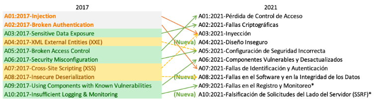
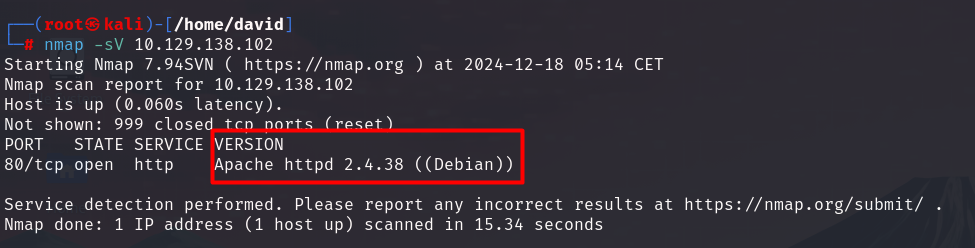
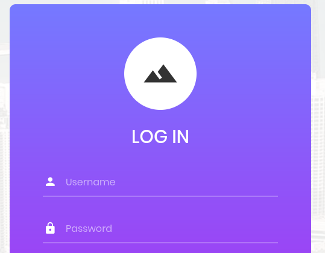
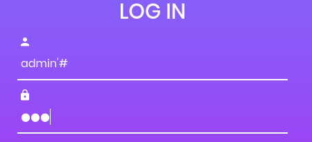
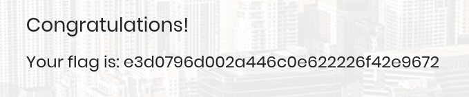

# Appointment

## Información General

- **Dificultad**: Very easy
- **Sistema Operativo**: Linux
- **Técnicas/herramientas usadas**: nmap / sql_injection / 

### Task 1 - What does the acronym SQL stand for?

SQL significa **Structured Query Language** (Lenguaje de Consulta Estructurado). Es un lenguaje utilizado para gestionar y manipular bases de datos relacionales, permitiendo realizar consultas, insertar, actualizar y eliminar datos, así como gestionar la estructura de la base de datos.

#### Answer -- Structured Query Language

### Task 2 - What is one of the most common type of SQL vulnerabilities?

Una de las vulnerabilidades más comunes en SQL es la inyección SQL (**SQL Injection**). Ocurre cuando un atacante manipula las consultas SQL enviadas a una base de datos mediante la inserción de código malicioso, lo que puede permitir el acceso no autorizado, la modificación o eliminación de datos, e incluso la toma de control del servidor.

#### Answer -- SQL Injection

### Task 3 - What is the 2021 OWASP Top 10 classification for this vulnerability?

Si nos fijamos en la imagen anterior, la tabla de OWASP TOP 10 clasifica esta vulnerabilidad como **A03:2021-Injection**

#### Answer -- A03:2021-Injection

### Task 4 - What does Nmap report as the service and version that are running on port 80 of the target?

Al lanzar nuestro escaneo de nmap, podemos ver la versión del servicio que está corriendo en el puerto 80:

#### Answer -- Apache httpd 2.4.38 ((Debian))

### Task 5 - What is the standard port used for the HTTPS protocol?

El puerto estándar utilizado para el protocolo HTTPS es el **443**.

#### Answer -- 443

### Task 6 - What is a folder called in web-application terminology?

En la terminología de aplicaciones web, una carpeta se llama directorio.

#### Answer -- directory

### Task 7 - What is the HTTP response code is given for 'Not Found' errors?

El código de respuesta HTTP **404** indica que el servidor no pudo encontrar el recurso solicitado. Esto suele ocurrir cuando la URL no corresponde a ningún archivo o página disponible en el servidor, mostrando típicamente un mensaje de "Página no encontrada".

#### Answer -- 404

### Task 8 - Gobuster is one tool used to brute force directories on a webserver. What switch do we use with Gobuster to specify we're looking to discover directories, and not subdomains?

En Gobuster podemos usar el parámetro **dir** para indicarle que estamos realizando una fuerza bruta de directorios.

#### Answer -- dir

### Task 9 - What single character can be used to comment out the rest of a line in MySQL?

El carácter **#** se utiliza en MySQL para comentar el resto de una línea. Cualquier texto que siga después del # en esa línea será ignorado por el motor de MySQL. Si navegamos hasta la web que hemos encontrado en nuestro escaneo de nmap (puerto 80). Podremos encontrar el siguiente panel de login:

Para proceder a una inyección SQL vamos a usar lo siguiente:

#### Answer -- "#"

### Task 10 - If user input is not handled carefully, it could be interpreted as a comment. Use a comment to login as admin without knowing the password. What is the first word on the webpage returned?

Al cerrar la consulta con una comilla simple, permite al script de login buscar el nombre de usuario del administrador. Como después de la comilla simple agregamos el símbolo de hastag, comentaremos el resto de la consulta lo que hará innecesaria la búsqueda de una contraseña coincidente para el nombre de usuario de administrador. Si lo ejecutamos, el servidor va a ver que hay un usuario administrador y cuando lo encuentre, ignorará todo lo demás y nos dará acceso (da igual la contraseña que se ponga).

Podemos ver como el servidor nos devuelve un mensaje de **Congratulations**.

#### Answer -- Congratulations

### Submit root flag

