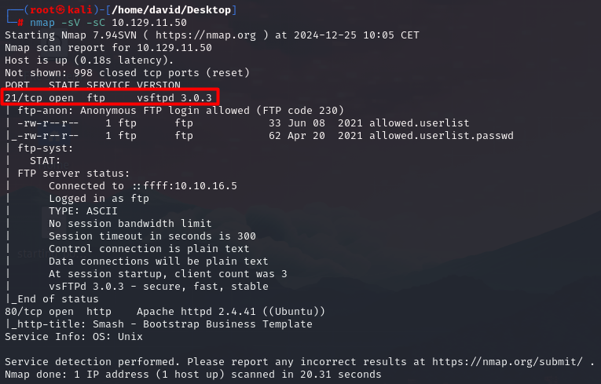
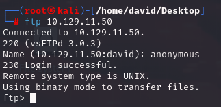
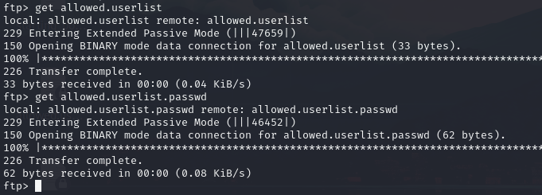
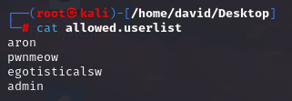
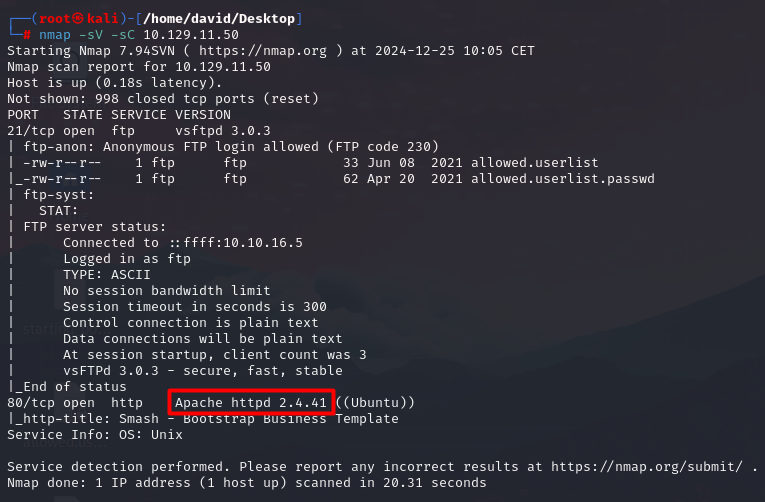
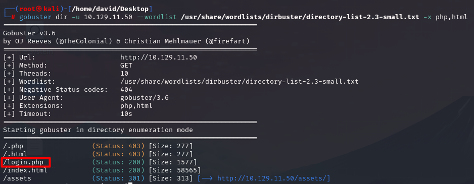
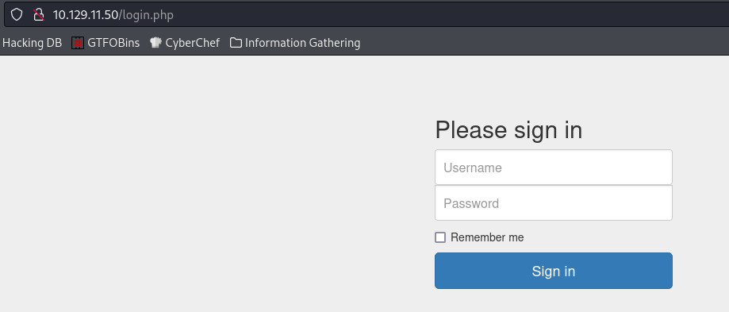

# Crocodile

## Información General

- **Dificultad**: Very easy
- **Sistema Operativo**: Linux
- **Técnicas/herramientas usadas**: nmap / ftp / gobuster / 

### Task 1 - What Nmap scanning switch employs the use of default scripts during a scan?

El switch de Nmap que utiliza los scripts predeterminados durante un escaneo es **-sC**. Este comando ejecuta los scripts básicos de Nmap para realizar pruebas adicionales, como la detección de servicios y vulnerabilidades comunes.

#### Answer -- -sC

### Task 2 - What service version is found to be running on port 21?

Al lanzar nuestro escaneo de nmap encontramos la siguiente información:

#### Answer -- vsftpd 3.0.3

### Task 3 - What FTP code is returned to us for the "Anonymous FTP login allowed" message?

Si nos fijamos detenidamente en la imagen anterior, al incluir el parámetro -sC en nuestro escaneo de nmap, podemos ver como ya se nos está indicando que el login con usuario "Anonymous" está permitido en FTP y el código que nos devolverá (**230**).

Con esta información, probamos a acceder al servicio de FTP y lo conseguimos sin ningún problema:

#### Answer -- 230

### Task 4 - After connecting to the FTP server using the ftp client, what username do we provide when prompted to log in anonymously?

Como hemos visto anteriormente, el usuario que necesitamos para conectarnos de forma anónima, es **anonymous**.

#### Answer -- anonymous

### Task 5 - After connecting to the FTP server anonymously, what command can we use to download the files we find on the FTP server?

Para poder descargar los archivos que creamos necesarios para la explotación de la máquina vamos a usar el comando **get**.

#### Answer -- get

### Task 6 - What is one of the higher-privilege sounding usernames in 'allowed.userlist' that we download from the FTP server?

Si hacemos un cat al archivo mencionado podemos ver como el usuario con mayores privilegios puede ser el de **admin**.

#### Answer -- admin

### Task 7 - What version of Apache HTTP Server is running on the target host?

Si volvemos a nuestro escaneo nmap, podemos encontrar la versión del servicio de Apache fácilmente como podemos observar en la siguiente imagen:

#### Answer -- Apache httpd 2.4.41

### Task 8 - What switch can we use with Gobuster to specify we are looking for specific filetypes?

En gobuster, además del descubrimiento de directorios, podemos filtrar nuestra búsqueda por tipo de archivos con el parámetro **-x**. En nuestro uso de gobuster vamos a usar dicho parámetro para que filtre los resultados con extensión php y html (generalmente son los que contienen las web y los paneles de login).

#### Answer -- -x

### Task 9 - Which PHP file can we identify with directory brute force that will provide the opportunity to authenticate to the web service?

Lanzamos nuestro escaneo de gobuster y encontramos los siguientes archivos:

Hemos encontrado un panel de login con la extensión .php.

#### Answer -- login.php

### Submit root flag

Para encontrar nuestra flag, ya que hemos descubierto un panel de login con extensión php y anteriormente encontramos una lista de usuarios y contraseñas, vamos a poner todo ello en común para poder acceder a dicho panel de login y encontrar nuestra flag.

El par de usuario y contraseña que nos ha funcionado ha sido el siguiente: admin:rKXM59ESxesUFHAd

