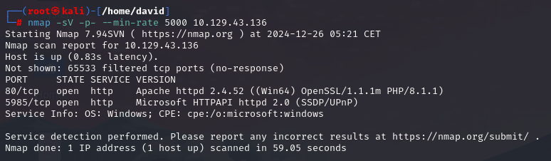

# Responder

## Información General

- **Dificultad**: Very easy
- **Sistema Operativo**: Windows
- **Técnicas/herramientas usadas**: nmap /  /  / 

### Task 1 - When visiting the web service using the IP address, what is the domain that we are being redirected to?

En primer lugar, lanzamos nuestro escaneo de nmap para ver qué puertos y servicios están disponibles para la explotación y encontramos lo siguiente:

#### Answer -- 

### Task 2 - 

#### Answer -- 

### Task 3 - 

#### Answer -- 

### Task 4 - 

#### Answer -- 

### Task 5 - 

#### Answer -- 

### Task 6 - 

#### Answer -- 

### Task 7 - 

#### Answer -- 

### Task 8 - 

#### Answer -- 

### Task 9 - 

#### Answer -- 

### Submit root flag

