# Responder

## Información General

- **Dificultad**: Very easy
- **Sistema Operativo**: Windows
- **Técnicas/herramientas usadas**: nmap / Responder / John The Ripper / Evil-Winrm / 

### Task 1 - When visiting the web service using the IP address, what is the domain that we are being redirected to?

En primer lugar, lanzamos nuestro escaneo de nmap para ver qué puertos y servicios están disponibles para la explotación y encontramos lo siguiente:


Probamos a acceder al servicio web (puerto 80) introduciendo la dirección IP y encontramos lo siguiente:

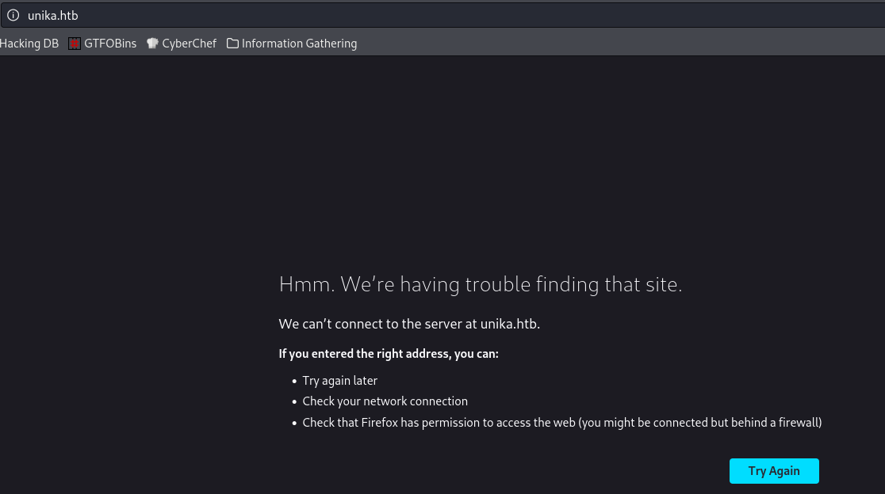

Al introducir la dirección IP se nos redirecciona al dominio unika.htb, pero no está resolviendo bien la solicitud por lo que vamos a modificar nuestro archivo /et/hosts de la siguiente manera:

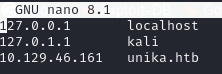

Ahora si volvemos a refrescar la página web, ya la podemos ver sin ningún problema:


#### Answer -- unika.htb

### Task 2 - Which scripting language is being used on the server to generate webpages?

Si utilizamos la extensión de **Wappalyzer** podemos ver como la página web está escrita en php.

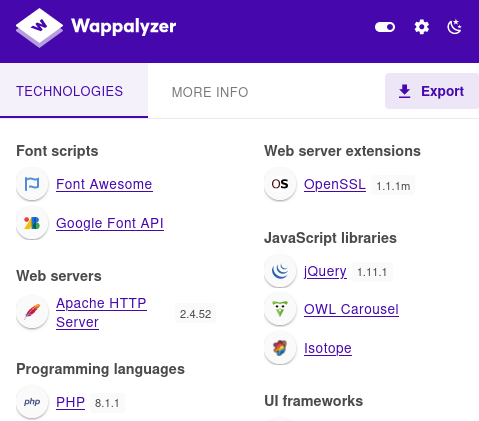

#### Answer -- php

### Task 3 - What is the name of the URL parameter which is used to load different language versions of the webpage?

En el menú de la web, si probamos a cambiar el lenguaje a francés por ejemplo, veremos como nuestra URL se modifica automáticamente apareciendo el parámetro **page** como se ve en la siguiente imagen:

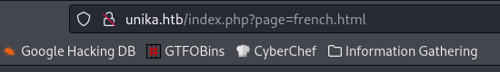

#### Answer -- page

### Task 4 - Which of the following values for the "page" parameter would be an example of exploiting a Local File Include (LFI) vulnerability: "french.html", "//10.10.14.6/somefile", "../../../../../../../../windows/system32/drivers/etc/hosts", "minikatz.exe"

Que la web responda así, puede ser un indicio de una vulnerabilidad LFI o RFI porque lo que vamos a probar con el siguiente ejemplo y veremos como se nos devuelve cierta información:

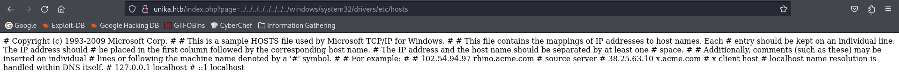

#### Answer -- ../../../../../../../../windows/system32/drivers/etc/hosts

### Task 5 - Which of the following values for the "page" parameter would be an example of exploiting a Remote File Include (RFI) vulnerability: "french.html", "//10.10.14.6/somefile", "../../../../../../../../windows/system32/drivers/etc/hosts", "minikatz.exe"

También podemos comprobar que la máquina es vulnerable a la inclusión remota de archivos ya que al modificar nuevamente el parámetro de la URL con un posible archivo que tuviéramos, también nos devuelve información:

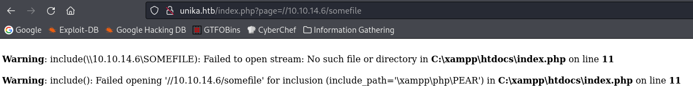

#### Answer -- //10.10.14.6/somefile

### Task 6 - What does NTLM stand for?

NTLM significa **New Technology LAN Manager**. Es un protocolo de autenticación utilizado en redes de Windows para autenticar usuarios y proteger sus credenciales mediante un desafío/respuesta sin enviar la contraseña directamente.

#### Answer -- New Technology Lan Manager

### Task 7 - Which flag do we use in the Responder utility to specify the network interface?

Ahora vamos a usar la herramienta conocida como **Responder** para enviar una solicitud igual que antes a la web y con responder abierto ver como obtenemos el hash NTLM. Para especificar la interfaz de red tenemos que seleccionar el parámetro **-I**.

```
python3 Responder.py -I tun0
```

Al ejecutar la anterior línea de comandos obtenemos lo siguiente:

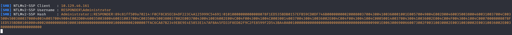

#### Answer -- -I

### Task 8 - There are several tools that take a NetNTLMv2 challenge/response and try millions of passwords to see if any of them generate the same response. One such tool is often referred to as "john", but the full name is what?.

Una vez que tenemos el hash NTLM, vamos a copiarlo a un archivo .txt para utilizar la herramienta **John The Ripper** y ver si podemos descifrar la contraseña."

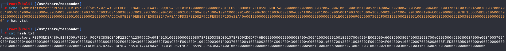

#### Answer -- John The Ripper

### Task 9 - What is the password for the administrator user?

Una vez que tenemos el hash NTLM en un archivo txt lo desciframos y obtenemos la contraseña fácilmente:

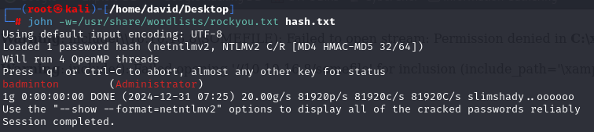

#### Answer -- badminton

### Task 10 - We'll use a Windows service (i.e. running on the box) to remotely access the Responder machine using the password we recovered. What port TCP does it listen on?

Ahora que tenemos el par de usuario y contraseña, vamos a usar la herramienta **evil-winrm** para conectarnos a la máquina de la siguiente manera:

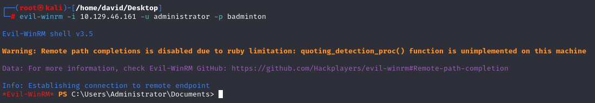

El puerto al que debemos acceder es el 5985 (revisar primera captura del escaneo de nmap)

#### Answer -- 5985

### Submit root flag

Una vez que nos hemos coenctado simplemente nos queda movernos por los directorios y encontrar la flag que se encuentra en la siguiente ubicación:

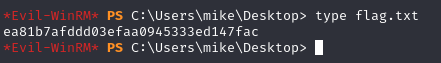