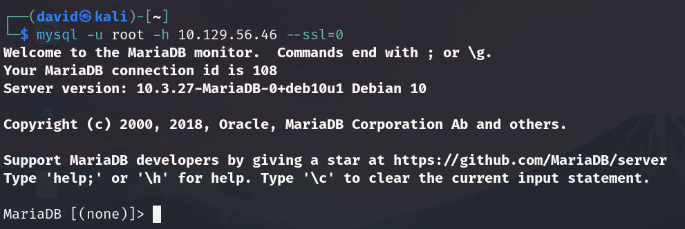
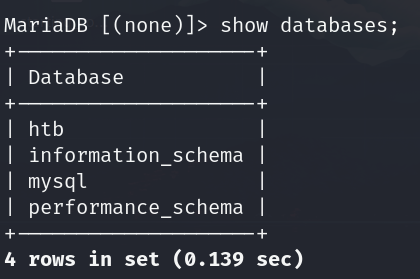
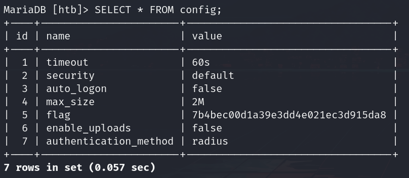

# Sequel

## Información General

- **Dificultad**: Very easy
- **Sistema Operativo**: Linux
- **Técnicas/herramientas usadas**: nmap / mysql / 

### Task 1 - During our scan, which port do we find serving MySQL?

En esta máquina hemos incluido el parámetro -sC durante nuestro escaneo para que nos ejecute una serie de scripts predefinidos que están diseñados para obtener información adicional sobre los servicios encontrados.

Como podemos ver en la imagen anterior, el puerto **3306** es el que está sirviendo el servicio de MySQL

#### Answer -- 3306

### Task 2 - What community-developed MySQL version is the target running?

Si nos fijamos en nuestro escaneo de nmap, podemos observar como en la versión aparece **MariaDB**. MariaDB es un sistema de gestión de bases de datos relacional, de código abierto, que surgió como una bifurcación de MySQL. Es compatible con MySQL, lo que permite usar aplicaciones y herramientas diseñadas para este.

#### Answer -- MariaDB

### Task 3 - When using the MySQL command line client, what switch do we need to use in order to specify a login username?

Para especificar el usuario al realizar una conexión mediante mysql, debemos indicar el parámetro **-u**.

#### Answer -- -u

### Task 4 - Which username allows us to log into this MariaDB instance without providing a password?

Por defecto vamos a probar a conectarnos con el usuario **root** y ver si por un fallo de configuración no se nos pide contraseña. Probamos a conectarnos de la siguiente forma:

A pesar de poner el comando correctamente, nos sale un error indicando que la conexión requiere de SSL, pero el servidor no lo soporta. Estuve buscando un tiempo como resolver este error y finalmente añadiendo un nuevo parámetro, obtuve una conexión exitosa:

#### Answer -- root

### Task 5 - In SQL, what symbol can we use to specify within the query that we want to display everything inside a table?

Debemos usar el símbolo de asterisco * para ver toda la información de una tabla.

#### Answer -- *

### Task 6 - In SQL, what symbol do we need to end each query with?

En SQL cada vez que introduzcamos una consulta o un comando debemos finalizarlo con el punto y coma.

#### Answer -- ;

### Task 7 - There are three databases in this MySQL instance that are common across all MySQL instances. What is the name of the fourth that's unique to this host?

Una vez que nos hemos conectado al servicio de MySQL, debemos ir recorriendo cada una de las bases de datos y tablas para encontrar nuestra flag. En primer lugar, vamos a usar el comando **show databases;** para ver todas las bases de datos que hay en el servicio.

Vamos a seleccionar la base de datos de **htb** que es la base de datos diferencial de esta máquina. 

#### Answer -- htb

### Submit root flag

Para ver la información que contiene usamos el comando **show tables;**.

Por último, para ver toda la información de una tabla (como vimos en la pregunta 5), debemos usar el símbolo * con el siguiente comando y podremos ver nuestra flag.

